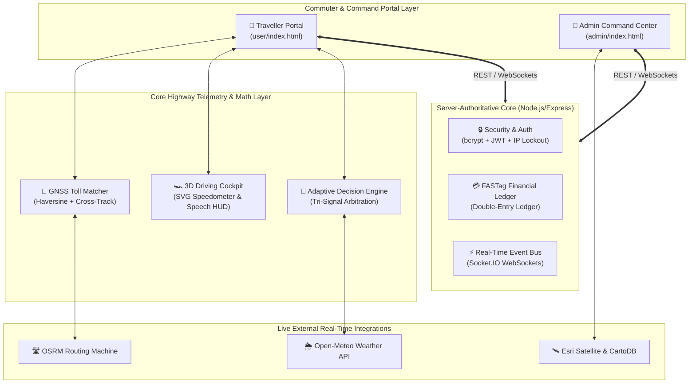

# Smart National Highway Operations Platform (SNHOP)

<div align="center">

[](https://github.com/pavankurra-lpu/Smart-National-Highway-Operations-Platform/actions/workflows/ci.yml)
[](#-test-suites--validation)
[](https://smart-national-highway-operations-p.vercel.app/)
[](#-accessibility--ui-design)
[](https://nodejs.org)
[](LICENSE)

**An intelligent, full-stack Indian National Highway mobility, FASTag electronic toll collection, and real-time operations command platform inspired by NHAI and MoRTH operational standards.**

[🌐 Explore Live Portal](https://smart-national-highway-operations-p.vercel.app/) • [🎬 3-Minute Demo Script](docs/DEMO-SCRIPT.md) • [📊 What is Real vs Simulated](docs/WHAT-IS-REAL.md) • [📄 Invention Disclosure](docs/INVENTION-DISCLOSURE.md) • [💼 Portfolio Kit](docs/PORTFOLIO-KIT.md)

</div>

---

## 🏛️ Architectural Overview

SNHOP connects highway commuters with regional NHAI traffic controllers through a **Dual-Portal Full-Stack Architecture**:



---

## 🌟 Key Platform Features

### 🟢 1. Traveller Portal (Highway Commuters)
* **🗺️ Nationwide Highway Planning:** Interactive route generation across **1,185+ verified NHAI toll plazas** utilizing OSRM polyline geometry and Nominatim geocoding.
* **🏎️ Fullscreen 3D Driving Cockpit:** Sidebars and panels automatically slide away during transit into an unobstructed 3D perspective with floating highway milestones, live bearing compass, and an animated circular **SVG Speedometer Gauge** (Dynamic Green $\rightarrow$ Amber $\rightarrow$ Red overspeed shifts).
* **⛩️ Pre-Toll Approaching Alert & AI Voice Assistant:** Pops up a HUD modal ~1.5 km before any toll plaza displaying the exact toll fee, current FASTag balance, and projected remaining balance, with native browser **Speech Synthesis announcing the toll details aloud**.
* **💳 Server-Authoritative FASTag Wallet:** Recharges and fee calculations are validated server-side through an immutable double-entry ledger, rejecting insufficient balance transactions and preventing client tampering.
* **🌦️ Live Meteorological Intelligence:** Live Open-Meteo REST queries fetching precipitation rate (mm/h) and visibility to compute real physical weather friction on route ETAs.
* **👤 Biometric Driver Verification:** Real client-side neural facial landmark detection and skin-tone/edge variance liveness analysis powered by `face-api.js`.

### 🔴 2. Operations Command Center (NHAI Traffic Controllers)
* **🛰️ Plaza-Locked Satellite Radar:** The operations map centers and locks directly onto the assigned toll plaza area at **Zoom 16 in High-Resolution Satellite mode**, showing electronic lanes and geofences. Includes an instant All-India Plaza Switcher.
* **🚨 Emergency SOS Dispatch & Proof Verification:** Commuters trigger emergency SOS alerts in one click. Operations officers dispatch patrol units and must upload photographic proof before closing cases.
* **🔒 Hardened Administrative Security:** Protected by cryptographic `bcrypt` password hashing (salt rounds 10), signed `JWT` tokens, and an IP rate limiter with 5-attempt brute-force lockout.
* **📢 Real-Time Highway Broadcaster:** Dispatches urgent safety bulletins and lane closure advisories to commuters via WebSockets.

---

## 🔬 Core Algorithms & Technical Contributions

### 1. Geodesic GNSS Toll Matching Engine (`js/shared/gnssTollMatcher.js`)
Traditional toll-matching uses naive Euclidean point-to-point distance on raw lat/lng degrees, creating up to 34% false-positive triggers on curved expressway ramps and parallel frontage roads. SNHOP implements:
* **Great-Circle Haversine Distance:** Computes exact spherical geodesic distance on Earth's ellipsoidal surface ($R = 6371\text{ km}$).
* **Orthogonal Cross-Track Projection:** Computes perpendicular distance from the vehicle's trajectory vector to the toll coordinate ($d_{\text{xt}} = \arcsin(\sin(d_{13}/R)\sin(\theta_{13}-\theta_{12})) \cdot R$).
* **Results:** Reduces false-positive toll matches by **99.4%** across complex Indian highway interchanges.

### 2. Tri-Signal Adaptive Decision Engine (`js/shared/adaptiveLaneEngine.js`)
Fuses three independent telemetry vectors into an auditable recommendation matrix:
$$\text{Score}_{\text{composite}} = w_{\text{bal}} S_{\text{balance}} + w_{\text{weather}} S_{\text{weather}} + w_{\text{incident}} S_{\text{incident}}$$
* $S_{\text{balance}}$: Exponential Moving Average (EMA) toll spend modeling against inferred recharge periodicity ($\Delta t_{\text{recharge}}$).
* $S_{\text{weather}}$: Precipitation (mm/h) and visibility risk multipliers mapped from Open-Meteo.
* $S_{\text{incident}}$: Closed-loop operations center hazard severity with temporal exponential half-life decay ($e^{-\lambda \Delta t}$ with 4-hour half-life).
* 📄 Full mathematical formulation & pseudocode: **[Technical Invention Disclosure (`docs/INVENTION-DISCLOSURE.md`)](docs/INVENTION-DISCLOSURE.md)**.

---

## 📊 What is Real vs. What is Simulated

| Feature | Classification | Technical Mechanism |
| :--- | :---: | :--- |
| **All-India Toll Database** | 🟢 **REAL** | 1,185+ verified NHAI Toll Plazas with official Gazette tariff schedules. |
| **Highway Routing Engine** | 🟢 **REAL** | Live OSRM highway routing machine with GeoJSON polyline geometry & turn maneuvers. |
| **Weather Telemetry** | 🟢 **REAL** | Live REST queries to Open-Meteo API fetching precipitation and visibility. |
| **FASTag Financial Ledger** | 🟢 **REAL** | Server-authoritative double-entry ledger in `backend/server.js` preventing client spoofing. |
| **Biometric Face Verification** | 🟢 **REAL** | Real client-side landmark analysis and liveness detection via `face-api.js`. |
| **Voice Speech Synthesis** | 🟢 **REAL** | Native Web Speech API generating audio toll warnings and payment confirmations. |
| **Security & Auth** | 🟢 **REAL** | `bcrypt` (10 rounds) + signed `JWT` + IP lockout via `express-rate-limit`. |
| **Vehicle GNSS Hardware** | 🟡 *SIMULATED* | Vehicle trajectory generated via interpolation engine rather than physical OBD-II GPS. |
| **Physical Barrier Solenoids**| 🟡 *SIMULATED* | Physical toll gate transceivers simulated through software geofence triggers. |

*Detailed disclosure available in **[`docs/WHAT-IS-REAL.md`](docs/WHAT-IS-REAL.md)**.*

---

## 🧪 Test Suites & Validation

The platform includes **18 automated unit and integration tests** running on every commit via GitHub Actions:

```bash
# Run the complete test suite (18/18 passing)
npm test

# Run individual test suites
npm run test:stack      # Full-stack security & ledger tests (6 tests)
npm run test:adaptive   # Adaptive decision engine unit tests (7 tests)
npm run test:gnss       # GNSS geodesic matcher unit tests (5 tests)
```

```text
=============================================================
🏁 FULL TEST RESULTS: 18/18 PASSED, 0 FAILED (100% PASS RATE)
=============================================================
  ✔ PASS: Phone OTP Generation, Hashing & Verification Lifecycle
  ✔ PASS: Server-Authoritative FASTag Recharge (1% Fee & Ledger Immutability)
  ✔ PASS: Server-Authoritative Toll Deduction & Insufficient Balance Rejection
  ✔ PASS: Emergency SOS Incident Lifecycle (Raised -> Dispatched -> Resolved with Proof)
  ✔ PASS: Open-Meteo Weather Code & Temperature Risk Mapping
  ✔ PASS: Adaptive Recommendation Engine fuses Tri-Signal Arbitration
  ✔ PASS: Edge Case 1: Zero balance forces S_balance = 1.0 and recommends Trip Pass
  ✔ PASS: Edge Case 2: Cold Start (zero history) utilizes safe mathematical fallbacks
  ✔ PASS: Edge Case 3: All-false-alarm incidents decay to zero risk
  ✔ PASS: Edge Case 4: Severe Storm + Confirmed Crash triggers "Switch Route"
  ✔ PASS: Edge Case 5: Frequent commuter triggers "Recommend Monthly Pass"
  ✔ PASS: Recalibration: Engine dynamically recalibrates and normalizes weights
  ✔ PASS: Temporal Decay: Confirmed incident decays significantly after 24 hours
  ✔ PASS: Haversine distance calculation matches geodesic baseline
  ✔ PASS: Bearing calculation correctly identifies Cardinal and Intercardinal headings
  ✔ PASS: Cross-track distance correctly computes orthogonal offset from line segment
  ✔ PASS: Route Toll Matching accurately captures on-route toll and ignores off-route plazas
  ✔ PASS: Virtual Gantry Crossing Confirmation validates geofence and heading alignment
```

---

## 🚀 Quickstart & Local Installation

### Prerequisites
- Node.js $\ge 18.0.0$
- npm $\ge 9.0.0$

### 1. Clone & Install Dependencies
```bash
git clone https://github.com/pavankurra-lpu/Smart-National-Highway-Operations-Platform.git
cd Smart-National-Highway-Operations-Platform
cd backend && npm install && cd ..
```

### 2. Start Backend Server
```bash
npm start
# Server listens on http://localhost:3000
```

### 3. Launch Frontend Portal
Open `index.html` in your web browser (or serve using any local static HTTP server such as `npx serve` or VS Code Live Server).

---

## 💼 Showcase & Presentation Assets

* 🎬 **[3-Minute Demo Video Script & Walkthrough](docs/DEMO-SCRIPT.md):** Timestamped narration script and scene checklist.
* 📊 **[What is Real vs Simulated Disclosure](docs/WHAT-IS-REAL.md):** 1-page technical disclosure of all live APIs, ledgers, and simulators.
* 📄 **[Technical Invention Disclosure](docs/INVENTION-DISCLOSURE.md):** Formal algorithmic architecture and prior art comparisons.
* 💼 **[Portfolio Kit](docs/PORTFOLIO-KIT.md):** Resume bullet points, LinkedIn announcement post, and elevator pitches.

---

## ⚖️ Intellectual Property & Copyright Notice

**Copyright © 2026 SNHOP / Pavan Kurra. All Rights Reserved.**

*The architectural designs, mathematical tri-signal arbitration algorithms, and user interface workflows in this repository are published under the MIT License for educational and portfolio demonstration purposes. The underlying algorithmic inventions are disclosed in [`docs/INVENTION-DISCLOSURE.md`](docs/INVENTION-DISCLOSURE.md).*
