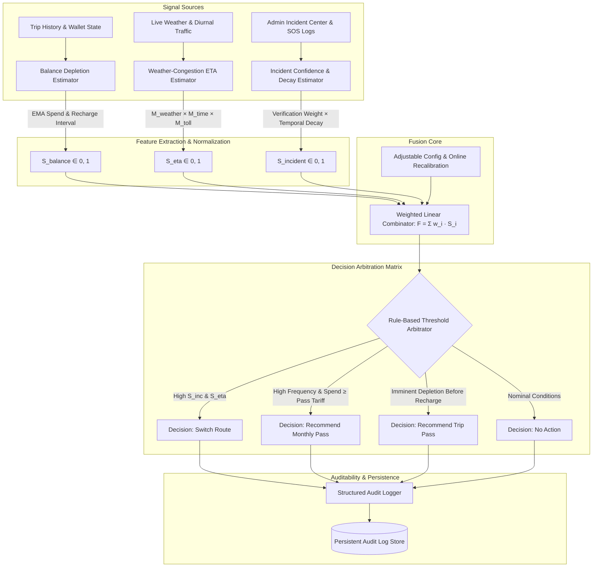

# Technical Invention Disclosure

## Title
**Multi-Signal Adaptive Decision Engine for Real-Time Toll-Pass Recommendation and Dynamic Route-Impedance Arbitration**

---

## 1. Problem Being Solved

Modern intelligent transportation systems (ITS) and electronic toll collection (ETC) infrastructures operate in distinct, uncoupled functional silos:

1. **Disconnected Financial and Routing States:**  
   Existing ETC systems (such as India's NETC FASTag, US E-ZPass, or European Telepass) operate purely as reactive transaction processing gateways. A vehicle's electronic wallet balance is checked only when the physical RFID/DSRC transceiver at a toll gantry is interrogated. If the account possesses insufficient funds, the vehicle is subjected to barrier denial, blacklisting, manual penalty collection (e.g., 2x cash surcharges under NHAI rules), and severe bottleneck queues. Conversely, navigation engines (such as Google Maps or Waze) route vehicles solely based on instantaneous road speed probes without any awareness of wallet solvency, projected multi-barrier toll expenditure, or prepaid pass optimization.

2. **Absence of Longitudinal Depletion Horizon Forecasting:**  
   Commuters frequently undertake multi-toll intercity or daily corridor journeys without realizing that their account balance will exhaust midway through the journey or across the next $N$ trips prior to their regular recharge cycle. Existing systems do not compute an exponential moving average (EMA) of user toll spend against inferred recharge periodicity to proactively recommend economical prepaid instruments (e.g., daily trip passes or monthly unlimited passes) before account lockout occurs.

3. **Open-Loop Hazard & Incident Reporting without Confidence-Decayed Feedback:**  
   Crowdsourced navigation platforms frequently maintain stale hazard markers long after an incident has cleared, while operations center incident logs fail to feed back verified resolution states into route risk calculations. A false alarm reported by a user can cause unnecessary regional traffic diversion, whereas a verified multi-vehicle crash requires a calibrated, exponentially decaying risk penalty that reflects physical clearance times.

### Objective
This invention provides a real-time, deterministic, and auditable tri-signal fusion engine that concurrently models:
1. Longitudinal wallet balance depletion velocity vs. recharge intervals,
2. Meteorological and empirical time-of-day/day-of-week congestion multipliers, and
3. Closed-loop, confidence-tagged incident risk subject to exponential temporal decay.

The engine arbitrates these signals into an actionable decision output (`"Recommend Monthly Pass"`, `"Recommend Trip Pass"`, `"Switch Route"`, or `"No Action"`), eliminating toll plaza account lockout, optimizing user expenditure, and preventing routing through high-risk obstructed corridors.

---

## 2. Prior Art Analysis

| Prior Art System | Operational Mechanism | Key Deficiencies / Differences from Disclosed Invention |
| :--- | :--- | :--- |
| **1. National Electronic Toll Collection (NETC / FASTag - NPCI/NHAI)** | Passive RFID (EPC Gen 2 / ISO 18000-6C) read at plaza gantry. Central clearinghouse (CCH) deducts toll from linked bank/prepaid wallet. If balance < threshold, tag is added to blacklist / low-balance exception file. | **No forward forecasting or route integration.** FASTag evaluates balance at the point of barrier arrival. It possesses no forward trajectory modeling ($N$ trips ahead), cannot infer user recharge intervals, does not integrate with navigation ETAs, and cannot recommend pass plans proactively before a trip commences. |
| **2. Crowdsourced Navigation Engines (Waze / Google Maps)** | GPS probe telemetry aggregated into road segment speeds. User-reported pins for hazards/police/accidents with thumbs-up/down voting. Routing uses Dijkstra/A* on time-variant edge weights. | **Financial blindness & uncalibrated incident persistence.** Routing engines have zero integration with financial ETC balances or toll pass tariff structures. Hazard markers rely on manual crowd voting rather than closed-loop highway operations center verification (`CONFIRMED` vs. `FALSE_ALARM`) with mathematical temporal exponential half-life decay. |
| **3. Dynamic / Congestion Tolling Systems (E-ZPass I-66 Express / Singapore ERP)** | Algorithmic toll pricing adjusted in 5–15 minute intervals based on highway segment loop-detector density and average velocity to maintain target throughput (e.g., 45 mph). | **System-centric pricing rather than user-centric adaptive arbitration.** Dynamic tolling adjusts the fee charged to drivers to manage demand; it does not evaluate the individual commuter's multi-trip solvency horizon, cannot project if the user will default on subsequent barriers, and does not fuse verified emergency dispatch feedback with user-level pass economics. |

---

## 3. Detailed Technical Description

### 3.1 Architecture and Data Flow

The engine ingests telemetry and state vectors from three independent subsystems, processes them through dedicated signal estimators, normalizes each feature into a unit interval $[0.0, 1.0]$, and applies a weighted linear combination evaluated against a deterministic decision matrix.



---

### 3.2 Mathematical Formulation

#### 3.2.1 Signal 1: FASTag Balance Depletion Forecast ($S_{\text{balance}}$)

Let the historical trip toll expenses be a sequence $C_1, C_2, \dots, C_K$. The rolling expenditure is modeled using an Exponential Moving Average (EMA) with smoothing parameter $\alpha \in (0, 1]$ (default $\alpha = 0.35$):

$$\text{EMA}_0 = C_{\text{default}}, \quad \text{EMA}_k = \alpha C_k + (1 - \alpha)\text{EMA}_{k-1}$$

If a proposed trip of cost $C_{\text{proposed}}$ is evaluated, the effective operational spend per trip is:

$$\bar{C}_{\text{trip}} = \alpha C_{\text{proposed}} + (1 - \alpha)\text{EMA}_K$$

Let the user's historical positive wallet recharges be recorded at timestamps $t_{r, 1}, t_{r, 2}, \dots, t_{r, M}$. The mean inter-recharge interval $\Delta t_{\text{recharge}}$ and inter-trip interval $\Delta t_{\text{trip}}$ are computed as:

$$\Delta t_{\text{recharge}} = \frac{1}{M-1} \sum_{j=2}^{M} (t_{r, j} - t_{r, j-1}), \quad \Delta t_{\text{trip}} = \frac{1}{K-1} \sum_{k=2}^{K} (t_{k} - t_{k-1})$$

The forward horizon of expected trips before the next recharge event is:

$$N_{\text{until\_recharge}} = \max\left(1, \left\lfloor \frac{\Delta t_{\text{recharge}}}{\Delta t_{\text{trip}}} \right\rfloor\right)$$

The projected balance $B_{\text{projected}}$ after $N_{\text{until\_recharge}}$ trips from current balance $B_{\text{current}}$ is:

$$B_{\text{projected}} = B_{\text{current}} - (N_{\text{until\_recharge}} \cdot \bar{C}_{\text{trip}})$$

The normalized depletion risk signal $S_{\text{balance}} \in [0.0, 1.0]$ is defined piecewise:

$$S_{\text{balance}} = \begin{cases}
1.0 & \text{if } B_{\text{current}} \le 0 \\
\min\left(1.0, 0.60 + 0.20 \cdot \frac{|B_{\text{projected}}|}{N_{\text{until\_recharge}} \cdot \bar{C}_{\text{trip}} + 1}\right) & \text{if } B_{\text{projected}} < 0 \\
\text{clamp}\left(\frac{\text{Buffer}_{\text{safe}} - B_{\text{projected}}}{\text{Buffer}_{\text{safe}}} \cdot 0.55, 0.0, 0.55\right) & \text{if } B_{\text{projected}} \ge 0
\end{cases}$$

where $\text{Buffer}_{\text{safe}} = 3 \cdot \bar{C}_{\text{trip}}$.

---

#### 3.2.2 Signal 2: Weather-Adjusted Congestion-Corrected ETA ($S_{\text{eta}}$)

The route delay multiplier $M_{\text{composite}}$ is the product of three independent scalars:

$$M_{\text{composite}} = M_{\text{weather}} \cdot M_{\text{time}} \cdot M_{\text{toll}}$$

1. **Weather Multiplier ($M_{\text{weather}}$):** Derived from physical meteorological indices:
   - Clear: $M_{\text{weather}} = 1.00$
   - Heatwave ($T > 42^\circ\text{C}$): $M_{\text{weather}} = 1.15$
   - Heavy Rain (Precipitation $> 25\text{mm/hr}$): $M_{\text{weather}} = 1.20$
   - Dense Fog (Visibility $< 100\text{m}$): $M_{\text{weather}} = 1.35$
   - Thunderstorm / Gale: $M_{\text{weather}} = 1.50$

2. **Time-of-Day / Day-of-Week Diurnal Multiplier ($M_{\text{time}}$):**  
   Computed from matching historical trip durations in stored history:
   $$M_{\text{time}} = \frac{\bar{V}_{\text{freeflow}}}{\bar{V}_{\text{historical}}(h, d)}$$
   where $h \in [0, 23]$ is hour of day and $d \in [0, 6]$ is day of week (fallback prior: weekday peak $= 1.30$, weekend peak $= 1.25$, off-peak $= 1.00$).

3. **Toll Plaza Congestion Multiplier ($M_{\text{toll}}$):**  
   For $P$ toll plazas on route with states $s_p \in \{\text{NORMAL}, \text{MODERATE}, \text{HIGH}\}$:
   $$M_{\text{toll}} = 1.0 + 0.45 \cdot \left(\frac{\sum [s_p = \text{HIGH}]}{P}\right) + 0.20 \cdot \left(\frac{\sum [s_p = \text{MODERATE}]}{P}\right)$$

The normalized signal $S_{\text{eta}} \in [0.0, 1.0]$ is scaled against ceiling $M_{\text{max}} = 2.5$:

$$S_{\text{eta}} = \text{clamp}\left(\frac{M_{\text{composite}} - 1.0}{M_{\text{max}} - 1.0}, 0.0, 1.0\right)$$

---

#### 3.2.3 Signal 3: Incident-Feedback Confidence & Temporal Decay ($S_{\text{incident}}$)

For each incident $i$ located within the spatial corridor of the route, let $\Delta t_i = t_{\text{eval}} - t_i$ be the elapsed time in hours. The risk score applies an exponential decay constant $\lambda = \frac{\ln(2)}{T_{1/2}}$ (where $T_{1/2} = 4.0\text{ hours}$):

$$\text{Decay}(t_i) = e^{-\lambda \Delta t_i}$$

Each incident is weighted by an administrative resolution verification factor $V_i$ and a severity coefficient $\sigma_i$:

$$V_i = \begin{cases}
+1.0 & \text{if status is RESOLVED and verificationType is CONFIRMED} \\
-0.5 & \text{if status is RESOLVED and verificationType is FALSE\_ALARM} \\
+1.4 & \text{if status is ACTIVE / DISPATCHED / RAISED}
\end{cases}$$

$$\sigma_i = \begin{cases}
1.2 & \text{if type is ACCIDENT / CRASH} \\
1.1 & \text{if type is ROAD\_BLOCK / WATERLOG} \\
0.7 & \text{if type is BREAKDOWN / TYRE\_BURST} \\
0.8 & \text{otherwise}
\end{cases}$$

The raw corridor incident score is:

$$\text{RawIncidentScore} = \sum_{i \in \text{RouteIncidents}} V_i \cdot \sigma_i \cdot e^{-\lambda \Delta t_i}$$

The normalized signal $S_{\text{incident}} \in [0.0, 1.0]$ with normalization constant $K_{\text{norm}} = 2.5$ is:

$$S_{\text{incident}} = \min\left(1.0, \frac{\max(0, \text{RawIncidentScore})}{K_{\text{norm}}}\right)$$

*Key Property:* If all reports on a corridor are resolved as `FALSE_ALARM`, $V_i < 0 \implies \text{RawIncidentScore} \le 0 \implies S_{\text{incident}} = 0.0$, guaranteeing zero false reroutes.

---

### 3.3 Fusion Formula & Decision Arbitration Matrix

The composite decision score $F \in [0.0, 1.0]$ is:

$$F = w_{\text{balance}} \cdot S_{\text{balance}} + w_{\text{eta}} \cdot S_{\text{eta}} + w_{\text{incident}} \cdot S_{\text{incident}}$$

where $\sum w_i = 1.0$ (default configuration: $w_{\text{balance}} = 0.35, w_{\text{eta}} = 0.35, w_{\text{incident}} = 0.30$).

#### Decision Matrix:

```
IF (S_incident ≥ 0.65 AND S_eta ≥ 0.50) OR (F ≥ 0.70 AND S_incident ≥ 0.40):
    OUTPUT := "Switch Route" [Priority: URGENT]

ELSE IF (HistoricalTripsCount ≥ 4 AND MonthlyTripsForecast ≥ 8 
         AND MonthlySpendForecast ≥ 1200 INR AND S_balance ≥ 0.45):
    OUTPUT := "Recommend Monthly Pass" [Priority: HIGH]

ELSE IF (S_balance ≥ 0.50) OR (S_balance ≥ 0.30 AND S_eta ≥ 0.40):
    OUTPUT := "Recommend Trip Pass" [Priority: MEDIUM]

ELSE:
    OUTPUT := "No Action" [Priority: LOW]
```

---

### 3.4 Algorithm Pseudocode

```text
Algorithm: EvaluateAdaptiveMultiSignalRoute
Input:
    currentBalance: Float
    proposedTripCost: Float
    tripHistory: List of TripRecords
    rechargeHistory: List of RechargeRecords
    weatherSummary: WeatherObject
    incidents: List of IncidentRecords
    routeCorridors: List of Strings
    currentTime: Timestamp
Output:
    AuditRecord containing { decision, compositeScore, signals, subMetrics, rationale }

Begin:
    // 1. Balance Signal Evaluation
    emaSpend ← CalculateEMA(tripHistory, alpha=0.35, default=120.0)
    effectiveSpend ← 0.35 * proposedTripCost + 0.65 * emaSpend
    deltaT_recharge ← MeanInterEventTime(rechargeHistory, fallback=336h)
    deltaT_trip ← MeanInterEventTime(tripHistory, fallback=48h)
    tripsUntilRecharge ← Max(1, Floor(deltaT_recharge / deltaT_trip))
    projectedBalance ← currentBalance - (tripsUntilRecharge * effectiveSpend)
    monthlySpendForecast ← (720h / deltaT_trip) * effectiveSpend
    
    If currentBalance <= 0 Then:
        S_balance ← 1.0
    Else If projectedBalance < 0 Then:
        S_balance ← Min(1.0, 0.60 + 0.20 * (|projectedBalance| / (tripsUntilRecharge * effectiveSpend + 1)))
    Else:
        S_balance ← Max(0.0, 0.55 * (3 * effectiveSpend - projectedBalance) / (3 * effectiveSpend))
    EndIf

    // 2. Weather-Congestion ETA Signal Evaluation
    M_weather ← LookupWeatherMultiplier(weatherSummary)
    M_time ← ComputeDiurnalMultiplier(tripHistory, currentTime)
    M_toll ← ComputePlazaCongestionMultiplier(routeCorridors)
    M_composite ← M_weather * M_time * M_toll
    S_eta ← Clamp((M_composite - 1.0) / (2.5 - 1.0), 0.0, 1.0)

    // 3. Incident Reliability & Decay Signal Evaluation
    lambda ← ln(2) / 4.0 // 4 hour half-life
    rawIncidentScore ← 0.0
    For Each inc in FilterCorridorIncidents(incidents, routeCorridors) Do:
        elapsedHours ← Max(0, (currentTime - inc.timestamp) / 3600000)
        decayFactor ← exp(-lambda * elapsedHours)
        verificationWeight ← MapVerificationWeight(inc.status, inc.verificationType)
        severityFactor ← MapSeverityFactor(inc.type)
        rawIncidentScore ← rawIncidentScore + (verificationWeight * severityFactor * decayFactor)
    EndFor
    S_incident ← Min(1.0, Max(0.0, rawIncidentScore) / 2.5)

    // 4. Fusion and Decision Output
    F ← (w_balance * S_balance) + (w_eta * S_eta) + (w_incident * S_incident)

    If (S_incident >= 0.65 And S_eta >= 0.50) Or (F >= 0.70 And S_incident >= 0.40) Then:
        decision ← "Switch Route"
    Else If Length(tripHistory) >= 4 And monthlySpendForecast >= 1200.0 And S_balance >= 0.45 Then:
        decision ← "Recommend Monthly Pass"
    Else If S_balance >= 0.50 Or (S_balance >= 0.30 And S_eta >= 0.40) Then:
        decision ← "Recommend Trip Pass"
    Else:
        decision ← "No Action"
    EndIf

    AuditRecord ← LogAuditTrail(currentTime, currentBalance, S_balance, S_eta, S_incident, F, decision)
    Return AuditRecord
End
```

---

## 4. What is Novel (Specific Technical Claims)

The novel technical features of this invention include:

1. **Closed-Loop Verification Feedback with Temporal Exponential Decay for Route Risk:**  
   Unlike crowd-voting systems (e.g., Waze), the engine introduces administrative closed-loop verification where resolving an emergency as `FALSE_ALARM` applies an immediate negative penalty ($V_i = -0.5$), mathematically extinguishing phantom congestion signals and suppressing unwarranted reroutes, while confirmed incidents decay along an exponential half-life ($\lambda = \frac{\ln 2}{T_{1/2}}$).

2. **Longitudinal Recharge-Interval Derived Depletion Forecasting:**  
   Rather than performing point-in-time threshold checks at the barrier gantry (as in standard FASTag/ETC), the engine computes the user's inter-recharge periodicity $\Delta t_{\text{recharge}}$ and inter-trip frequency $\Delta t_{\text{trip}}$ to project balance solvency $N$ steps forward ($B_{\text{current}} - N \cdot \text{EMA}$).

3. **Unified Tri-Signal Financial-Operational Arbitration:**  
   The concurrent arbitration of financial wallet depletion risk ($S_{\text{balance}}$), physical route delay ($S_{\text{eta}}$), and decaying hazard risk ($S_{\text{incident}}$) into a single deterministic decision vector that selects between corridor rerouting (`"Switch Route"`) and prepaid financial toll optimization (`"Recommend Monthly Pass"` / `"Recommend Trip Pass"`).

---

## 5. Explicit Limitations and Open Questions

### 5.1 Simulation Assumptions vs. Production Deployment

| Aspect | Current Simulation Implementation | Production Viability Requirement |
| :--- | :--- | :--- |
| **Data Sync & Storage** | Browser `localStorage` / REST JSON backend (`Storage.js`). | Distributed, ACID-compliant ledger / Apache Kafka stream processing for transaction logs and NPCI NPC CCH message queues. |
| **Incident Verification** | Admin operations portal manual resolution dropdown (`CONFIRMED` / `FALSE_ALARM`). | Automated highway patrol CAD (Computer Aided Dispatch) integration, CCTV ANPR incident verification models, and police GIS feeds. |
| **Toll Transaction Latency** | Simulated in-browser geofence deduction (0.5–1.0 sec). | DSRC/RFID transponder handshake ($<100\text{ms}$ at $40\text{km/h}$) with asynchronous bank clearing. |
| **Weight Calibration** | Static heuristic defaults ($0.35 / 0.35 / 0.30$) with manual API recalibration (`recalibrateWeights`). | Online Reinforcement Learning (RL) or logistic regression continuously trained on user acceptance rates and corridor throughput metrics. |

### 5.2 Open Engineering Questions
1. **Cold-Start User Convergence:** What minimum sample size of trips ($K$) is required before $\Delta t_{\text{trip}}$ stabilizes sufficiently to replace heuristic national priors?
2. **Adversarial False Alarm Defense:** If an operator mistakenly tags a real hazard as a false alarm, what secondary telemetry (e.g., average floating vehicle speeds from GPS) should override the negative incident weight?
3. **Cross-Corridor Multi-Operator Settlement:** How should monthly pass recommendations be split when a trip traverses toll plazas managed by competing state vs. national highway concessionaires?

---

*This document is engineering documentation of a specific algorithmic mechanism implemented in the Smart National Highway Operations Platform.*
